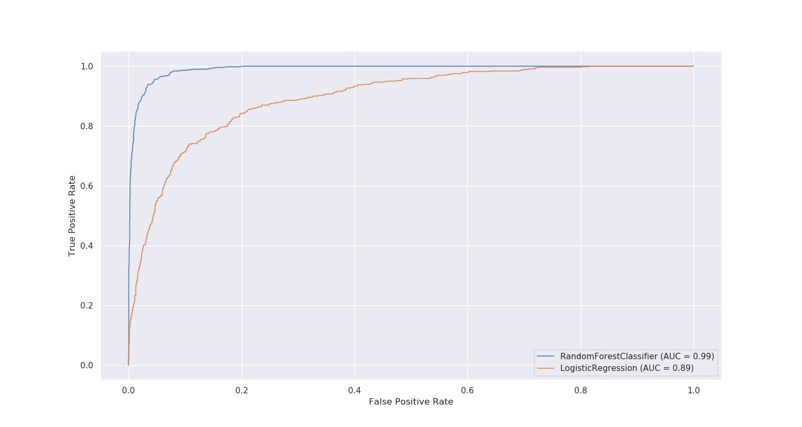
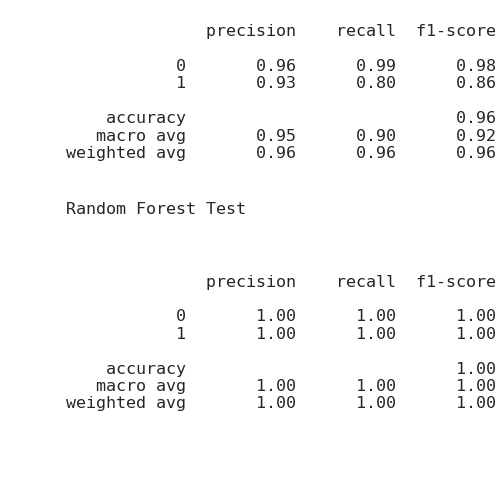

# Predict Customer Churn

- Project **Predict Customer Churn** of ML DevOps Engineer Nanodegree Udacity

## Project Description
This project aims to find customers that are likely to churn based on credit card. The project involves the following steps:

- Load dataset and perform exploratory data analysis 
- Prepare data - feature engineering involving creating additional useful features for training
- Train two ML models - Logistic Regression & Random Forest
- Identify most important features influencing the churn prediction
- Save best models along with their performance metrics in roc, classification report


## Files and data description

The project is organized along the following directory architecture:

- data : contains input dataset in csv format

- images 
   - eda : contains images from the data exploration
   - results : contains model scores, confusion matrix, ROC curve, feature importances

- models : contains saved models in .pkl format

- logs : log generated during testing of churn_library.py

- churn_library.py : training script 

- churn_notebook.ipnyb : training notebook

- churn_script_logging_and_tests.py : unit tests for churn_library.py

- requirements.txt : requirements file to install libraries

    
## Running Files
- Install packages
```bash
pip install --r requirements.txt
```
- Run churn prediction:
```bash
python churn_library.py
```
- Test churn prediction:
```bash
python churn_script_logging_and_tests.py
```

## Classification performance

- ROC Curves of the developed models


- Confusion Matrix of Random Forest model
